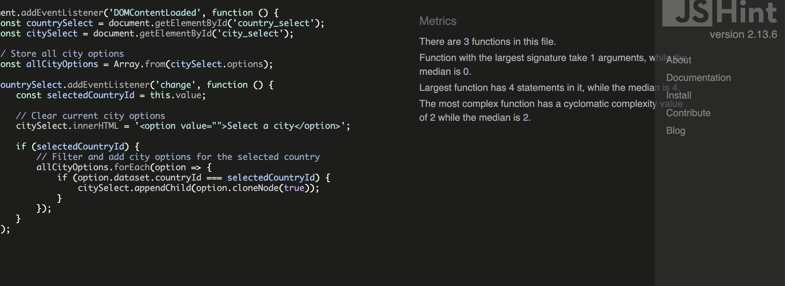

# SafeSurgeon

Choosing the right surgeon is a critical decision that can significantly impact your health and well-being. However, finding trustworthy and comprehensive information about medical professionals can be challenging. Safe Surgeon bridges this gap by offering a reliable platform where you can: Check the surgeon's education, board certifications, and licenses. Learn about their specialties, years of practice, and areas of expertise.
With Safe Surgeon, you have the tools you need to make informed decisions about your healthcare.

## Our Goal
Our goal is to enhance patient safety and trust in the medical community by:
Promoting Transparency and providing up-to-date and accurate information about surgeons.
Empowering Users: Allowing patients to make informed choices based on verified data.
Improving Healthcare Outcomes: Helping users select qualified professionals for better medical experiences.

Join us in making healthcare safer and more transparent for everyone.

## Project Description 
This project allows users to search for surgeons and check their verification status. It also enables surgeons to sign up, create a profile by submitting their details for admin verification, and, once verified or rejected by the admin, access their profile page to edit and keep it up to date. If rejected, surgeons can resubmit their updated details for verification. Every time a surgeon changes their details, their status is automatically reset to pending, requiring them to go through admin verification before accessing their profile page again.

### User Search Functionality:

Users can log in and search for a surgeon using the surgeon’s name, clinic, country, and city.
The search results will indicate if the surgeon is:

Verified (present in the database and verified),
Rejected (their verification was denied),
Pending(signup but awaiting admin verification) or
Not Verified (not in the database at all).

#### Surgeon Signup and Verification:

Surgeons can sign up by filling in a form with their details and uploading supporting documents.
After submission, the surgeon’s profile is marked as “pending verification” and requires administrative review. 

The admin can change the surgeon's status to either rejected or verified. Depending on this status, not only does the surgeon's profile appearance in the search results change, but also  their profile. If rejected, the surgeon has the chance to reapply with updated documentation and details.

If a surgeon decides to change, delete, or add already verified details, their profile is automatically reset to pending in the database.

### Profile Management:

Once a surgeon is added to the database, idependently if rejcted or verified, they can log into their profile.There they can: 
#### edit, delete, add.
If they make changes to their profile, it will reset their verification status to "pending," and the profile will need to go through the verification process again before it is accessible to them.
This system ensures that users can access accurate, up-to-date information about surgeons' verification status, while allowing surgeons to manage their profiles with ease.

### Design:
Simplicity by Design: Trust and Reliability.

The Safe Surgeon app is intentionally designed with a minimalistic and straightforward approach to enhance trust, reliability, and user confidence. 

The simplicity is not just aesthetic—it's purposeful, reflecting the app’s seriousness and professionalism. Here’s why this design approach is a plus:

- Minimal Color Palette for Seriousness: The restrained use of color avoids distracting visuals, helping users focus on the core functionality—verifying surgeon credentials and clinic affiliations.

-	Trustworthiness through Simplicity: A clean, no-frills interface fosters reliability. Users are more likely to trust a platform that is easy to navigate and free from clutter, as it reflects transparency and a focus on accuracy.

-	Ease of Use for All: The minimalist design ensures that users, regardless of age or technical proficiency, can navigate the app effortlessly. This reduces frustration and enhances user experience, reinforcing confidence in the app’s purpose.

By combining a simple layout with a minimal color palette, Safe Surgeon delivers a focused, serious, and reliable platform, ensuring users can quickly and confidently verify their surgeon’s credentials.

### Landing Page

-	Provides Simple Navigation: Offers two clear options—one for users to verify a surgeon and another for surgeons to start the verification process.

-	User-Friendly Layout: Designed for ease of use, the page presents only two buttons, minimizing confusion and simplifying the user journey.

-	Access to Surgeon Profiles: Features a dropdown menu that allows surgeons to log in directly to their profile and users to navigate other parts of the site easily.

#### Why it benefits the user:

-	Streamlined Experience: The simplicity of the home page makes it easy for users to quickly access the action they need without being overwhelmed by too many options.

-	Quick Surgeon Verification: Patients can efficiently verify their surgeon’s credentials with just a few clicks, enhancing trust and transparency.

-	Easy Access for Surgeons: Surgeons can log in to their profile directly from the home page, ensuring a convenient and seamless process for managing their verification status.

### Navigation Bar 

- The Safe Surgeon app features a simple, intuitive navigation bar and dropdown menu designed for seamless movement between pages. This functionality is crucial to ensuring a smooth, frustration-free experience for both patients and surgeons.

- User-Centric Design: Simple and intuitive navigation helps users focus on their primary tasks without confusion. Whether verifying credentials or updating profiles, users can do so with minimal clicks, improving both satisfaction and efficiency.

#### Why it benefits the user:
-	Effortless Navigation: The navigation bar and dropdown menu make it easy to move between different sections of the app. Whether users are verifying a surgeon or surgeons are managing their profiles, the ability to switch between tasks effortlessly enhances the overall usability of the platform.

-	Quick Surgeon Login: For surgeons, the dropdown menu provides quick access to log in to their profile, making the verification process fast and simple. This reduces unnecessary steps and ensures surgeons can manage their credentials efficiently.

- By prioritizing easy navigation and quick login options, Safe Surgeon ensures that users can access the necessary features without hassle, making the verification process smooth and reliable.

### Surgeon Search Page

-  Performs Surgeon Search: Users input the surgeon's country, city, name, and clinic to execute a search for the specific surgeon they want to verify.

- Simple Form Submission: Once the necessary details are filled in, users can submit the form to retrieve verified information about the surgeon, including credentials and clinic affiliations.

- Minimalist Design: The search page uses a clean, black-and-white color scheme to maintain a professional and serious atmosphere, keeping the focus on the task at hand.

#### Why it benefits the user:

- Direct and Simple Search Process: The clear and straightforward form allows users to quickly and easily perform the search, without unnecessary complexity.

- Trustworthy Information: The clean design reinforces a sense of seriousness and reliability, giving users confidence in the results of their search.

- Focused User Experience: By using minimal colors and a simple layout, the page ensures that users are not distracted and can efficiently find the information they need.

### Search Result Page: Surgeon Verified

-	Displays the surgeon’s basic details such as their name, clinic, and location.

-	Showcases the surgeon's credentials and verification status, prominently marked as "Verified" in green.

-	Highlights any additional relevant details such as education history and professional background.

#### How it benefits the user:
-	Provides instant reassurance by clearly indicating the surgeon's verification status, ensuring trustworthiness.

-	Allows users to verify the professional background of the surgeon they are considering, ensuring peace of mind.

-	Offers a simple, streamlined design focusing on delivering crucial verification information without distractions.

### Rejected Surgeon Page

-	Displays the surgeon’s basic details but marks the surgeon's verification status as "Rejected" in red.

-	Provides any available information about why the verification failed, if applicable.

-	Highlights the lack of verified credentials, which may raise concerns for the user.

#### How it benefits the user:

-	Alerts the user about potential red flags with the surgeon by showing their rejected status clearly.

-	Helps users make informed decisions by understanding that the surgeon’s credentials did not meet verification standards.

-	Simplifies the decision-making process, making it easier to avoid unverified or untrustworthy practitioners.

### Pending Surgeon Page

- Displays the surgeon’s basic details but marks the surgeon's verification status as "Pending" in yellow.

- Indicates that the surgeon has signed up and is currently in the process of being verified by the admin.

- Provides a clear message that the surgeon's credentials are still under review and not yet approved, signaling that they are actively engaging with the platform.

### How it benefits the user:

-Reassures the user that the surgeon is not ignoring their presence on the app but has proactively submitted their details for verification, showing their intent to comply with the platform’s standards.

- Helps users distinguish between verified and unverified surgeons, while positively reflecting on those whose credentials are pending, indicating they are committed to getting verified.

- Encourages transparency by clearly communicating that the surgeon’s credentials are not yet available for confirmation, allowing users to trust that the surgeon is actively pursuing verification and that more information will soon be available.

### Surgeon Not Found (Not Verified) Page

- The page displays a strong warning in bold pink with red accents that the surgeon is "Not Verified" and is not present in the database. 

- The bold design is a clear indication that the surgeon cannot be considered reliable.

- The user is informed that the surgeon's credentials cannot be verified because they are not in the system. 

#### How it benefits the user:

-	Clearly communicates when a surgeon cannot be verified, helping users avoid unknown or unlisted professionals.

-	Provides reassurance that the system is thorough and won’t return a false positive verification.

-	Encourages the user to double-check their information or search for alternative, verified surgeons.

### Sign up page

-	Provides an option for the surgeon to verify their credentials by guiding them to a secure signup page.

-	Allows the surgeon to create a user profile by entering essential information, protected by a secure username and password.

-	Ensures a simple, serious, and trustworthy design with minimal distractions, focusing on security and the importance of verification.

#### How it benefits the user:

-	Offers a clear and secure path for surgeons to begin the verification process, boosting their credibility and professional standing.

-	Ensures that the signup process is straightforward and user-friendly while maintaining a high level of data security through password protection.

-	Instills trust through a serious and professional design, giving the surgeon confidence that their personal and professional information is handled securely and with integrity.

### Get Verified Form Page

-	Provides a secure form for surgeons to fill in their personal details and professional credentials.

-	Allows surgeons to upload supporting documents such as certificates and identification for verification purposes.

-	Presents the form in a clean, no-nonsense design, similar to forms used in medical professions, reinforcing professionalism.

#### How it benefits the user:

-	Creates a structured and familiar environment for surgeons, building trust by mimicking other professional medical forms they are accustomed to.

-	Ensures that surgeons can easily submit the necessary credentials and documents, simplifying the verification process.

-	Enhances the feeling of security and seriousness, ensuring that the surgeon feels their credentials are handled with care and integrity, reinforcing the credibility of the site.

### Verification Pending Page

-	Displays a confirmation message informing the surgeon that their verification request has been submitted and is now pending review.

-	Provides reassurance by explaining that the review process is underway.

-	Projects a calm, serene atmosphere using a mint blue color scheme, ensuring a professional and reassuring experience after submission.

#### How it benefits the user:

-	Instills a sense of calm and reassurance, letting the surgeon know their submission was successful and is being handled professionally.

-	Helps reduce anxiety by clearly stating that the verification process is pending, eliminating any uncertainty about the next steps.

-	The simple and clean design, with a soothing color scheme, reinforces trust in the verification process while maintaining a professional tone.

### Log in page Page

-	Provides a simple and secure login form where surgeons can enter their username and password to access their profile.

-	Directs surgeons to their profile page upon successful login, where they can review or update their credentials and verification status.

-	Features a minimalist design focused solely on the login form, reflecting professionalism and trustworthiness.

#### How it benefits the user:

-	Offers a straightforward way for surgeons to log into their profile, ensuring ease of access without distractions.

-	Promotes security through a focused and streamlined login form, assuring users their data is protected.

-	Maintains a professional tone with a simple and clean design, reinforcing the seriousness of the site’s purpose.

### Surgeon Profile Page:Verified

-	Displays all of the surgeon's submitted personal and professional details, including clinic information, education, and verification status.

-	Highlights the verification status prominentlyin green, indicating the surgeon has been successfully verified .-	Provides an option for surgeons to edit their information and resubmit if their details change.

### How it benefits the user:

-	Allows surgeons with a "Verified" status to easily review their data, ensuring they stay informed about their verification outcome and their profile displays information that is up to date.

-	Enhances transparency by clearly displaying the current verification status and providing options for editing if their details have chnaged.

-	Gives surgeons control over their profile, enabling them to make updates and resubmit their information for re-verification, if necessary.

### Surgeon Profile Page: Rejected

- Displays the previously submitted personal and professional details, and verification status.

 - Highlights the verification status prominently as "Rejected" , making it clear that their submission did not meet the verification requirements, with actionable steps needed.

- Provides an editable profile section where surgeons can update their details, correct any issues, and resubmit their profile for re-verification. The "Submit for Re-verification" button is clearly available for surgeons to initiate the re-evaluation process .

#### How it benefits the user:

- Clear Feedback: Surgeons with a "Rejected" status are given immediate, clear feedback on their profile, allowing them to understand the current state of their verification.

- Editable and Actionable: Surgeons are empowered to easily edit and update their information, ensuring they can fix any discrepancies and resubmit their profile for review without starting the process from scratch.

- Streamlined Re-verification: The "Submit for Re-verification" functionality simplifies the re-evaluation process, reducing the friction in getting verified and maintaining up-to-date professional credentials.

### Drop down widged for Education Details

- Consolidated Information: A dropdown menu allows additional education details to be neatly tucked away, providing a cleaner look on the profile page while still making the information easily accessible when needed.

- User-Friendly Design: Instead of overwhelming users with all education details upfront, the dropdown ensures a streamlined interface where users can choose to view more in-depth information only if they are interested.

- Space Efficiency: By using a dropdown, the page layout stays compact, ensuring that crucial profile information like clinics, verification status, and personal details are emphasized without being crowded by additional educational details.

### How it benefits the user:

- Clutter-Free Layout: Users can review the surgeon’s basic information without scrolling through long sections of educational details unless they choose to expand them.

- On-Demand Information: Users can easily access extra educational qualifications or certifications with a simple click, providing them with detailed insights when they want it, but not forcing them to view everything upfront.

- Improved Navigation: A dropdown structure simplifies navigation, keeping the most important information prominent, while extra data remains hidden but accessible, contributing to a more intuitive user experience.

### Edit Profile Prompt

- Displays a confirmation prompt when the surgeon clicks the Edit button, informing them that making changes to their profile will require resubmission and re-evaluation.

- Clearly states that editing the profile will initiate the full verification process again, meaning their current "Verified" or "Rejected" status will be replaced with a "Pending" status until the new information is reviewed.

- Provides the option to either confirm and proceed with editing, or cancel and return to their profile page without making changes.

#### How it benefits the user:
- Transparency: Ensures surgeons are fully aware that any edits will trigger the complete re-verification process, preventing misunderstandings about their status.

- Decision Clarity: Gives surgeons a chance to reconsider if they want to proceed with changes, allowing them to avoid unnecessary delays if their current verification status is satisfactory.

- Control: Empowers surgeons to either move forward with updates or keep their profile as is, maintaining full control over their re-verification timeline.

### Surgeon Profile Edit Page

-	Allows surgeons to edit their existing profile data, such as personal details, clinic information, and education credentials and easily edit them.

-	Provides the option to upload new documents, including certifications and ID verification, to support their profile update.

-	Offers a "Resubmit for Verification" button after changes have been made, initiating the re-verification process.

#### How it benefits the user:

-	Enables surgeons to keep their profile data accurate and up to date, ensuring their credentials are properly maintained.

-	Simplifies the process of adding new qualifications or documents, making it easy to enhance or correct their profile for re-verification.

-	Provides control over their verification status, allowing them to resubmit their profile with updated information for another review, particularly useful if they were previously rejected.

### Post-Submission Pending Verification Page

-	Displays a personalized message thanking the surgeon by name for updating their profile and resubmitting their credentials.

-	Notifies the surgeon that their verification status is now pending, and that their updates will be reviewed.

-	Projects a sense of calm and professionalism with a mint blue color scheme, reinforcing trust and transparency in the verification process.

#### How it benefits the user:

-	Provides immediate confirmation that their submission was successful, giving the surgeon peace of mind.

-	Reassures the surgeon that their updated credentials are under review, reducing any uncertainty about the next steps in the verification process.

-	The use of mint blue creates a serene and calming environment, making the user experience feel professional and stress-free during the waiting period.

### About Page

-	Provides an overview of the website’s mission and the team or individuals behind the platform.

-	Offers insight into the values and purpose of the site, such as how it supports surgeon verification and ensures user trust.

-	Explains the process and importance of verification, highlighting the platform’s commitment to professionalism.

#### How it benefits the user:

-	Helps users understand the purpose and trustworthiness of the site, fostering confidence in the service.

-	Strengthens the credibility of the platform by introducing the team and explaining their expertise and background.

-	Enhances transparency by clearly explaining how the verification process works, ensuring users feel secure and informed.

### Contact Page

-	Provides a simple form for users to send a direct message, including fields like name, email, and message.

-	Offers a quick and easy way for users to reach out with questions, feedback, or inquiries related to the site or services.

#### How it benefits the user:

-	Facilitates easy communication, making it convenient for users to reach out for support or queries.

-	Saves time by providing a straightforward and minimal form that ensures a smooth user experience.

### Footer

#### Minimal Footer Design: Benefits
- Focus on Core Content: By opting for a minimal footer with only a copyright symbol, the attention remains on the core functionality and features of the application rather than distracting the user with unnecessary social media links or additional information.

- Streamlined User Experience: A simple footer reduces visual clutter, allowing users to navigate and interact with the site or application without additional elements that may divert focus from the primary purpose of the platform.

- Professional Look: Avoiding social media links or unrelated content maintains a professional and polished design, ensuring the application’s branding and purpose remain clear and unobstructed.

- Privacy and Security Conscious: Not including external links, especially to social media, helps keep the user experience self-contained and reduces the potential for privacy concerns related to tracking or third-party integrations.

#### How it benefits the user:

- Undistracted Focus: Users can concentrate on the task or content at hand without extraneous links drawing their attention away.

- Faster Load Times: By not loading additional social media icons or widgets, the page remains lightweight, contributing to faster load times.

- Simplicity and Elegance: A minimalist approach to the footer reinforces a clean, user-friendly design that aligns with professional standards, making it easier for users to engage with the site’s primary purpose.

### Simple Logout Page

•	Clean and Direct: The logout page is kept simple, focusing on a single primary action—logging out—while also providing clear, secondary options to reset the password or delete the account, without overwhelming the user with unnecessary details.
•	Confirmation for Logout: Before logging out, users are prompted with a confirmation to ensure they intend to end their session, preventing accidental logouts and ensuring they don’t unintentionally lose access to their current session or work.
•	Security Features: The page provides essential account management actions such as deleting the account or resetting the password, offering a one-stop location for important decisions related to account security and maintenance.

### How it benefits the user:

-	Focused Design: Users aren’t distracted by unnecessary content. The clear call to action makes it easy to log out, while secondary options for password reset or account deletion are available if needed.

-	Error Prevention: The logout confirmation ensures users don't accidentally log out of their session, providing an extra layer of assurance that they’re making a conscious choice.

-	Convenient Account Management: With the additional options to reset the password or delete the account, users can easily manage their account security from one simple page, giving them full control over their login credentials and account status.

### Wireframes

Wireframes for both the mobile and desktop versions were created using https://moqups.com/, ensuring that the structure and flow of the website are visually mapped out before development. 

### The live app can be found on:

https://safesurgeon-f2f78c12cdcc.herokuapp.com/

To see the VERIFIED surgeon profile and ability to edit and delete, please sign in with a verified user:

##### Username:Henrik
##### Password:Monster0483

To see the VERIFIED user found in the data base:

Serach: 
Country: UK, 
City:London, 
Clinic:SafeMedic, 
First Name: Henio 
Last Name: Tideman

To see a REJETED user found in database:

Serach:
Country: Sweden, 
City:Malmö, 
Clinic:AkutB or MediCare, 
First Name: Miriam 
Last Name: Lukasiak

To see a REJECTED surgeon profile, and ability to edit and delete, please sign in with:

##### Username: Miriam
##### Password: 123

To see a PENDING user found in database:

Serach: 
Country: UK, 
City: London, 
Clinic:SafeMedic 
First Name: Paul 
Last Name: McMenamin

To see what happens when a PENDING surgeon tries to sign in, please sign in with:
##### Username: Paul
##### Password: 123

### Features Left to Implement
- A forgot password feature on login

- Make a surgeon be able to add different clinics in different towns.

### Testing

#### Manual Testing

#####  Browser Compatibility:
Test the app on different browsers like Safari, Chrome, and Firefox to ensure consistency.

- User Login and Authentication:

- Log in as a user using valid credentials.

- Attempt to log in with incorrect credentials to verify error handling.

- Surgeon Search Functionality:

- Search for surgeons by name, clinic, country, and city.

- Verify that the search returns accurate results (verified, rejected, not in the database).

##### Surgeon Signup Process:

- Fill out the signup form with required details and documents.

- Verify that form submission successfully moves the surgeon to the pending verification state.

##### Profile Management:

- Edit details (e.g., name, clinic, or city) and save changes.

- Ensure the profile is reset to pending status after edits.

- Attempt to log in with pending status and ensure access is restricted.

##### Document Uploads:

- Test uploading profile pictures and documents (Cloudinary integration).

##### Responsive Design:

-Resize the browser window to different screen sizes to ensure the page responds well to various resolutions.

### Validation

#### HTML
W3C HTML Validator
There were no errors found on any page using the W3C HTML Validator.

https://validator.w3.org/nu/?doc=https%3A%2F%2F8000-agnieszkalu-safesurgeon-jnqo6orcz3z.ws.codeinstitute-ide.net%2F

https://validator.w3.org/nu/?doc=https%3A%2F%2F8000-agnieszkalu-safesurgeon-jnqo6orcz3z.ws.codeinstitute-ide.net%2Fverify%2F

https://validator.w3.org/nu/?doc=https%3A%2F%2F8000-agnieszkalu-safesurgeon-jnqo6orcz3z.ws.codeinstitute-ide.net%2Fsignup%2F

https://validator.w3.org/nu/?doc=https%3A%2F%2F8000-agnieszkalu-safesurgeon-jnqo6orcz3z.ws.codeinstitute-ide.net%2Fget_verified%2F

https://validator.w3.org/nu/?doc=https%3A%2F%2F8000-agnieszkalu-safesurgeon-jnqo6orcz3z.ws.codeinstitute-ide.net%2Fget_verified%2F

https://validator.w3.org/nu/?doc=https%3A%2F%2F8000-agnieszkalu-safesurgeon-jnqo6orcz3z.ws.codeinstitute-ide.net%2Flogin%2F

https://validator.w3.org/nu/?doc=https%3A%2F%2F8000-agnieszkalu-safesurgeon-jnqo6orcz3z.ws.codeinstitute-ide.net%2Fget_verified%2F

https://validator.w3.org/nu/?doc=https%3A%2F%2F8000-agnieszkalu-safesurgeon-jnqo6orcz3z.ws.codeinstitute-ide.net%2Fsurgeon%2F113%2Fedit%2F

https://validator.w3.org/nu/?doc=https%3A%2F%2F8000-agnieszkalu-safesurgeon-jnqo6orcz3z.ws.codeinstitute-ide.net%2Fabout%2F

https://validator.w3.org/nu/?doc=https%3A%2F%2F8000-agnieszkalu-safesurgeon-jnqo6orcz3z.ws.codeinstitute-ide.net%2Fcontact%2F

https://validator.w3.org/nu/?doc=https%3A%2F%2F8000-agnieszkalu-safesurgeon-jnqo6orcz3z.ws.codeinstitute-ide.net%2Faccounts%2Flogout%2F

### Jigsaw
W3C CSS Validator
There were no errors found in the stylesheet using the W3C CSS Validator.

https://jigsaw.w3.org/css-validator/validator?uri=https%3A%2F%2F8000-agnieszkalu-safesurgeon-jnqo6orcz3z.ws.codeinstitute-ide.net%2F&profile=css3svg&usermedium=all&warning=1&vextwarning=&lang=en

https://jigsaw.w3.org/css-validator/validator?uri=https%3A%2F%2F8000-agnieszkalu-safesurgeon-jnqo6orcz3z.ws.codeinstitute-ide.net%2Fverify%2F&profile=css3svg&usermedium=all&warning=1&vextwarning=&lang=en

https://jigsaw.w3.org/css-validator/validator?uri=https%3A%2F%2F8000-agnieszkalu-safesurgeon-jnqo6orcz3z.ws.codeinstitute-ide.net%2Fverify_result%2Fpaul%2Fanna%2FSafeFace%2FStockholm%2FSweden%2F&profile=css3svg&usermedium=all&warning=1&vextwarning=&lang=en

https://jigsaw.w3.org/css-validator/validator?uri=https%3A%2F%2F8000-agnieszkalu-safesurgeon-jnqo6orcz3z.ws.codeinstitute-ide.net%2Fsignup%2F&profile=css3svg&usermedium=all&warning=1&vextwarning=&lang=en

https://jigsaw.w3.org/css-validator/validator?uri=https%3A%2F%2F8000-agnieszkalu-safesurgeon-jnqo6orcz3z.ws.codeinstitute-ide.net%2Fget_verified%2F&profile=css3svg&usermedium=all&warning=1&vextwarning=&lang=en

https://jigsaw.w3.org/css-validator/validator?uri=https%3A%2F%2F8000-agnieszkalu-safesurgeon-jnqo6orcz3z.ws.codeinstitute-ide.net%2Flogin%2F&profile=css3svg&usermedium=all&warning=1&vextwarning=&lang=en

https://jigsaw.w3.org/css-validator/validator?uri=https%3A%2F%2F8000-agnieszkalu-safesurgeon-jnqo6orcz3z.ws.codeinstitute-ide.net%2Fsurgeon%2F113%2Fedit%2F&profile=css3svg&usermedium=all&warning=1&vextwarning=&lang=en

https://jigsaw.w3.org/css-validator/validator?uri=https%3A%2F%2F8000-agnieszkalu-safesurgeon-jnqo6orcz3z.ws.codeinstitute-ide.net%2Faccounts%2Flogout%2F&profile=css3svg&usermedium=all&warning=1&vextwarning=&lang=en

https://jigsaw.w3.org/css-validator/validator?uri=https%3A%2F%2F8000-agnieszkalu-safesurgeon-jnqo6orcz3z.ws.codeinstitute-ide.net%2Fabout%2F&profile=css3svg&usermedium=all&warning=1&vextwarning=&lang=en

https://jigsaw.w3.org/css-validator/validator?uri=https%3A%2F%2F8000-agnieszkalu-safesurgeon-jnqo6orcz3z.ws.codeinstitute-ide.net%2Fcontact%2F&profile=css3svg&usermedium=all&warning=1&vextwarning=&lang=en

### Jshint (Java script)
https://jshint.com/

W3C CSS Validator
There were no errors found in the java script files.

#### results for edit_surgon_profile.js

#### results for get_verified.js

#### results for verify.js

#### results for contact.js

#### PEP8 (https://pep8ci.herokuapp.com/)
#### No errors were returned when passing through the official PEP8 validator.

#### results for views.py

#### results for url.py

#### results for models.py

#### results for forms.py

#### results for admin.py

### Bugs
There are no unfixed bugs.

### Deployment
This project was deployed at Heroku, steps for deploy are listed bellow:

Creat a new Heroku app.

Set up the configs for the deployment.

Link the Heroku app to the repository, then Deploy.

The live link can be found here: SafeSurgon

### Credits:

- The icon form SafeSurgeon are from design.com

- The photos of team member from istockphoto.

-	Django Documentation - For handling form submission, views, and templates.
-	Django Allauth Documentation - For user authentication and profiles.
-	Cloudinary Documentation - For image and document uploads (profile pictures, ID documents).
-	Django Packages - Collection of reusable apps, tools, and libraries for Django.
-	PythonAnywhere - For hosting Django projects with deployment tutorials.
-	Mozilla Developer Network (MDN) - For HTML, CSS, and JavaScript best practices.
-	W3Schools - A resource for front-end development basics and quick references.
-	Bootstrap Snippets on Bootsnipp - Ready-to-use Bootstrap snippets for layout and design.
-	CodePen - For front-end design inspiration and snippets (CSS/HTML/JavaScript).
Learning Platforms
-	Real Python - Django tutorials, Python web development, and guides.
-	FreeCodeCamp - Web development tutorials, including Django and Bootstrap.
-	Stack Overflow - A community for troubleshooting and getting help from developers.
-	GitHub - For collaborating on and finding open-source Django projects.
-	Code Institute Slack Community - Official student support community for solving coding issues.
-	The Net Ninja Django Tutorials - YouTube tutorials focusing on building applications with Django.
-	Django Rest Framework - For building APIs or handling external integrations with Django.
-	Awesome Django on GitHub - A curated list of Django apps, projects, and resources.

### Aknowladgments

-	My mentor, Moritz Wach, for his incredible patience, quidance and support.

- My fellow students for their company and encouragement.

- Sarah at Code Intitute Mentoring, for her incredible patience and hawk-eye.

- Kay at CondeInstitute for being my mental support on this crazy journey.
